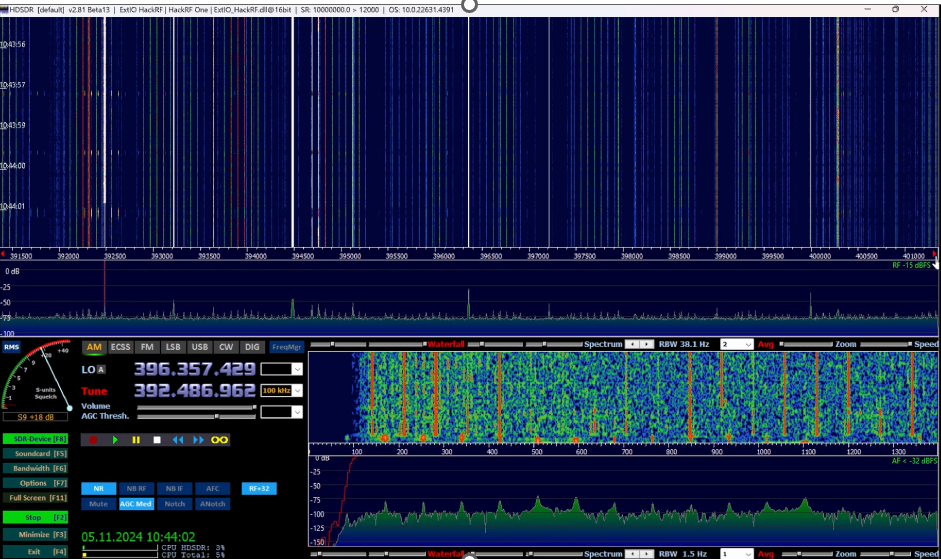

# 🌐 **TEMPEST – Eavesdropping on Electromagnetic Emissions**  
> **⚡️ A TEMPEST attack** uses electromagnetic emissions, sounds, and vibrations to gather information about the target. In this case, the image signal of a monitor is extracted and displayed – possible with a Software Defined Radio (SDR) and appropriate software.  

🎥 **Demo Video:** [📁 TempestDemo.mp4](media/TempestDemo.mp4)  

---

## 🛠️ Software and Hardware  

One of the following programs is required to reconstruct the received image:  

- [TempestSDR](https://github.com/martinmarinov/TempestSDR)  
- [gr-Tempest](https://github.com/git-artes/gr-tempest)  
- [deep-Tempest](https://github.com/emidan19/deep-tempest)  

Additionally, a classic SDR software like [HDSDR](https://hdsdr.de/) is needed to find the frequency.  
A [Demo Video](https://github.com/eried/Research/blob/master/HackRF/TempestSDR/tempest_test_elize_song.mp4) is also helpful.  

### 📡 **Recommended Hardware:**  
- **Basic SDR Device:** [RTL-SDR on Amazon](https://www.amazon.de/DVB-T-DAB-Stick-RTL2832U-Chipsatz/dp/B0C4DXV2CC/)  
- **More Powerful SDR Device:** [HackRF One](https://opensourcesdrlab.com/products/h4m-receiver-and-spectrum-analyzer?VariantsId=10005)  

|  |  
| :---------------------------------------------: |  
| *HackRF One + Portapack and 32dBi Antenna (SDR)* |  

---

## 🔧 Preparation and Installation  

- Installation of **TempestSDR**, **gr-tempest**, or **deep-tempest**.  
- See the instructions in the respective GitHub repositories.  

---

## 🕵️‍♂️ Performing the Attack  

### 1️⃣ **Finding the Frequency of the Monitor**  

1. Play the video on the target monitor.  
2. Search for the monitor frequency in the SDR software.  
3. If the song "Für Elise" is heard, the frequency has been found.  
4. Note down the frequency.  

|  |  
| :--------------------------------------: |  
| *Classic SDR Software for Searching the Monitor Frequency* |  

|  |  
| :------------------------------------------: |  
| *Screenshot from the Test Video for Frequency Search (Für Elise)* |  

**⚠️ Important:** This procedure is only for illustration.  
In realistic attack scenarios, the monitor frequency is calculated based on parameters such as size, resolution, and frequency.  

---

### 2️⃣ **Configuring TempestSDR**  

1. Enter the monitor parameters and frequency.  
2. Load the device driver.  
3. Start the process.  

|  |  
| :------------------------------------------------: |  
| *TempestSDR: Monitor parameters (left) and loaded driver (right)* |  

---

### 3️⃣ **Image Reconstruction**  

1. If no image is visible, choose the highest peak.  
2. Adjust parameters.  

|  |  
| :---------------------------------------------: |  
| *Captured Image* |  

---

## 📚 Links to the Used Papers  

- [Deep-Tempest](https://arxiv.org/pdf/2407.09717v1)  
- [gr-Tempest](https://iie.fing.edu.uy/publicaciones/2022/LBCS22/LBCS22.pdf)  

---

## 📂 Additional Materials  

In the `media/` folder, you'll find:  
- Screen captures of the attack in real-time.  
- A brief step-by-step guide as a video.  

  - **Demo Video:** [TempestDemo.mp4](media/TempestDemo.mp4)  
  - **Sound of the captured test video:** [fuerElise.mp4](media/fuerElise.mp4)  
  - **Best Attempt on a Canvas:** [BestAttempt.mp4](media/BestAttempt.mp4)  
  - **TempestSDR Settings:** [TempestSDR.mp4](media/TempestSDR.mp4)  
  - **Attack on a Webpage:** [Webpage.mp4](media/Webpage.mp4)  
