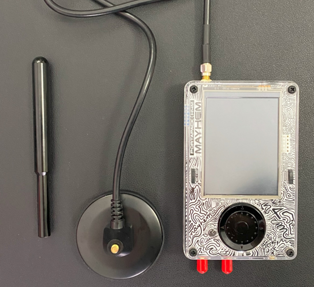
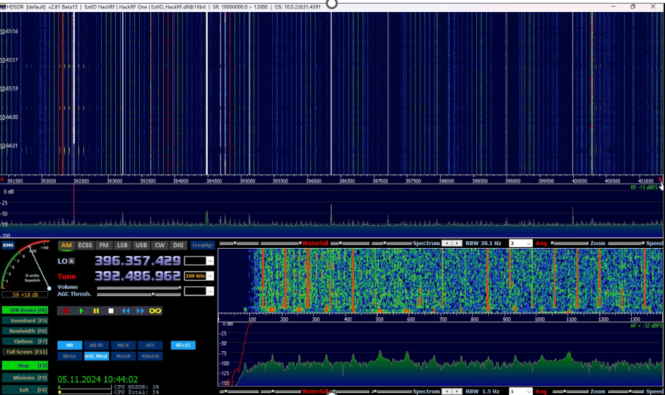
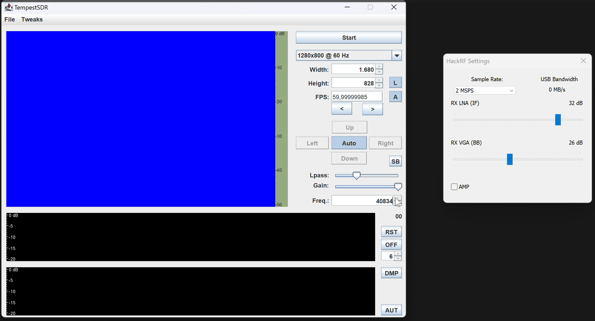
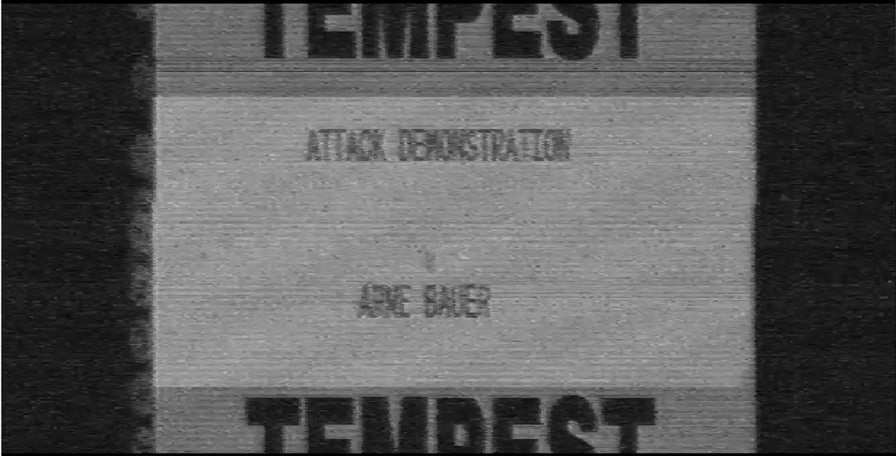

# TEMPEST – Abhören elektromagnetischer Emissionen
  
> **Ein TEMPEST-Angriff** nutzt elektromagnetische Emissionen, Geräusche und Vibrationen, um Informationen über das Ziel zu erhalten. Hier wird das Bildsignal eines Monitors extrahiert und angezeigt – möglich mit einem Software Defined Radio (SDR) und entsprechender Software.

---

---

## Software und Hardware

Eine der folgenden Programme zur Rekonstruktion des empfangenen Bildes wird benötigt:

- [TempestSDR](https://github.com/martinmarinov/TempestSDR)  
- [gr-Tempest](https://github.com/git-artes/gr-tempest)  
- [deep-Tempest](https://github.com/emidan19/deep-tempest)  

Zusätzlich wird eine klassische SDR-Software wie [HDSDR](https://hdsdr.de/) benötigt, um die Frequenz zu finden. Ein [Demo-Video](https://github.com/eried/Research/blob/master/HackRF/TempestSDR/tempest_test_elize_song.mp4) ist ebenfalls nützlich.

### Empfohlene Hardware:
- **Einfaches SDR-Gerät:** [RTL-SDR auf Amazon](https://www.amazon.de/DVB-T-DAB-Stick-RTL2832U-Chipsatz/dp/B0C4DXV2CC/)  
- **Leistungsfähigeres SDR-Gerät:** [HackRF One](https://opensourcesdrlab.com/products/h4m-receiver-and-spectrum-analyzer?VariantsId=10005)  

|  |
| :---------------------------------------------: |
| *HackRF One + Portapack und 32dBi Antenne (SDR)* |

## Vorbereitung und Installation

- Installation von **TempestSDR**, **gr-tempest** oder **deep-tempest**  
- Siehe die Anleitungen in den jeweiligen GitHub-Repositories.

## Durchführung des Angriffs

### 1. Finden der Frequenz des Monitors

1. Abspielen des Videos auf dem anzugreifenden Monitor.  
2. Suche der Monitorfrequenz in der SDR-Software.  
3. Wenn das Lied „Für Elise“ zu hören ist, wurde die Frequenz gefunden.  
4. Notiere die Frequenz.  

|  |
| :--------------------------------------: |
| *Klassische SDR Software zum Suchen der Monitorfrequenz* |

|  |
| :------------------------------------------: |
| *Screenshot aus dem Test-Video zur Frequenzsuche (Für Elise)* |

**Wichtig:** Dieses Vorgehen dient nur der Veranschaulichung. In realistischen Angriffsszenarien wird die Monitor-Frequenz basierend auf Parametern wie Größe, Auflösung und Frequenz berechnet.

### 2. Konfiguration von TempestSDR

1. Eingabe der Monitorparameter und der notierten Frequenz in TempestSDR (oder in einer anderen Tempest-Software).  
2. Laden des Gerätetreibers.  
3. Starten des Vorgangs.  

|  |
| :------------------------------------------------: |
| *TempestSDR: Monitorparameter (links) und geladener Treiber (rechts)* |

### 3. Bildrekonstruktion

1. Falls kein Bild sichtbar ist, wähle den höchsten Ausschlag in der Software aus.  
2. Mit leichtem Anpassen der Parameter und Geduld können die Ergebnisse verbessert werden.

|  |
| :---------------------------------------------: |
|                  *Abgefangenes Bild*            |

## Links zu den verwendeten Papern

- [Deep-Tempest](https://arxiv.org/pdf/2407.09717v1)  
- [gr-Tempest](https://iie.fing.edu.uy/publicaciones/2022/LBCS22/LBCS22.pdf)

## Weitere Materialien

Im Ordner `media/` befinden sich Bildschirmaufnahmen des Angriffs in Echtzeit sowie eine kurze Schritt-für-Schritt-Anleitung als Video.

- **Demo-Video:** [TempestDemo.mp4](media/TempestDemo.mp4)  
- **Sound des abgefangenen Test-Videos:** [fuerElise.mp4](media/fuerElise.mp4)  
- **Bester Angriff auf einen Canvas:** [BestAttempt.mp4](media/BestAttempt.mp4)  
- **Einstellungen von TempestSDR:** [TempestSDR.mp4](media/TempestSDR.mp4)  
- **Angriff auf eine Webpage:** [Webpage.mp4](media/Webpage.mp4)  

